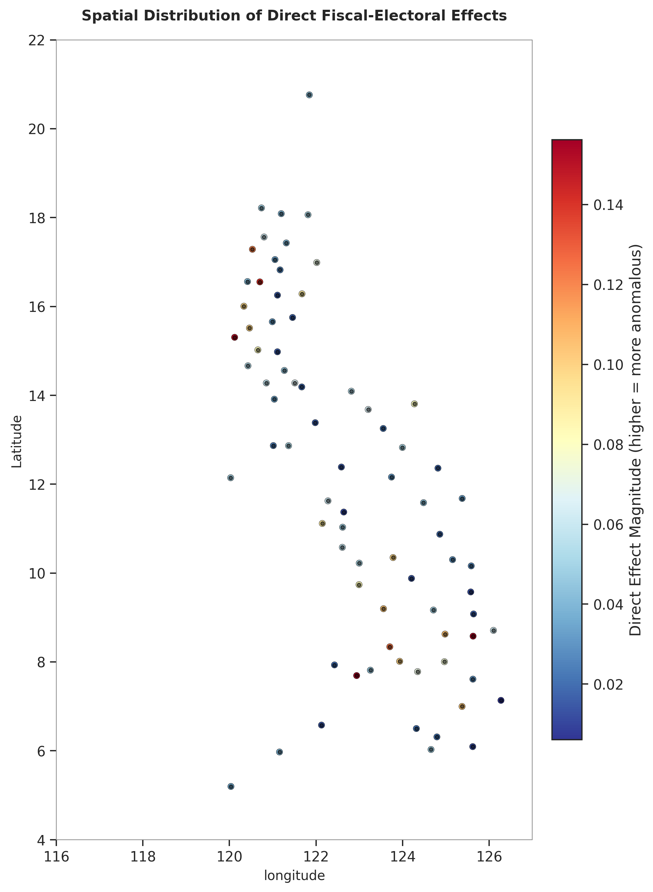
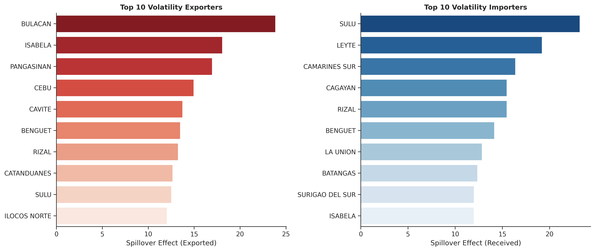
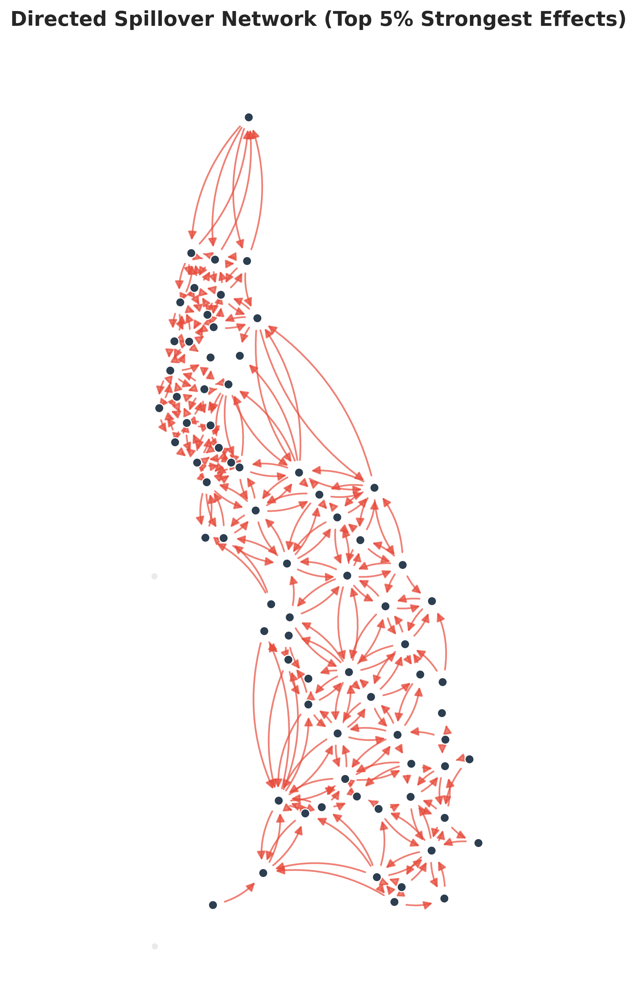
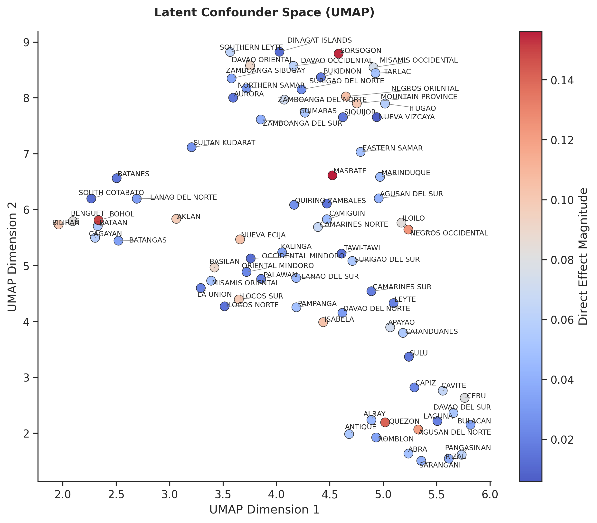
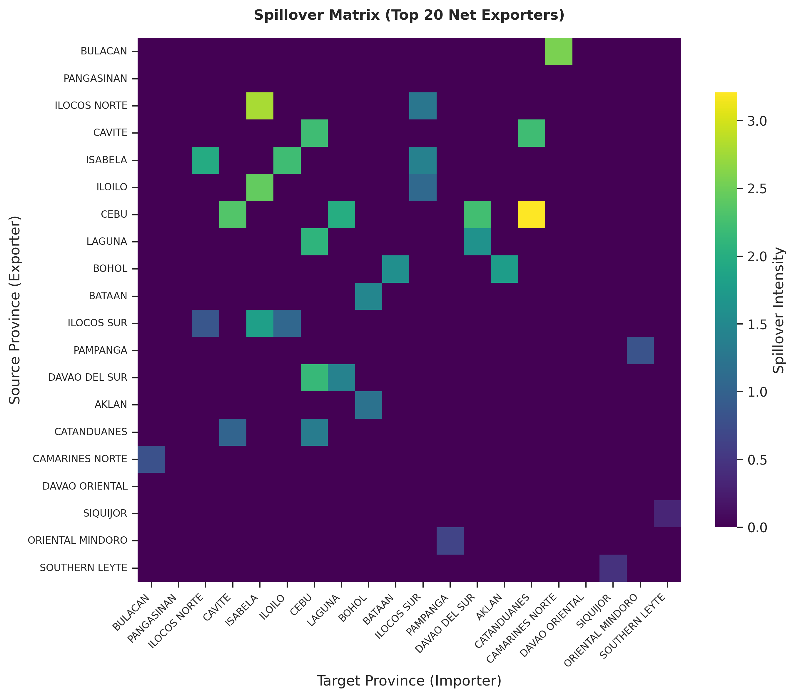

# FiscoNet: Mapping Asymmetric Fiscal-Electoral Spillovers Across Philippine Provinces via Graph Variational Autoencoders

[](https://opensource.org/licenses/MIT)
[](https://www.python.org/)
[](https://pytorch.org/)

This repository contains the official implementation of **FiscoNet**, a Graph Variational Autoencoder (Graph VAE) that learns a structured decomposition of fiscal-electoral panel data into **direct**, **spillover**, and **confounder** components. The model produces the first directed influence map of fiscal spillovers across Philippine provinces (1992–2022).


*Figure 1: Direct fiscal-electoral effect by province. Red = strong own‑policy influence, blue = weak influence. Black dots indicate province centroids.*

---

## 📌 Table of Contents
* [Overview](#overview)
* [Dataset](#dataset)
* [Methodology](#methodology)
* [Results](#results)
* [Repository Structure](#repository-structure)
* [Installation](#installation)
* [Usage](#usage)
* [Citation](#citation)
* [License](#license)

---

## Overview
Standard regression methods assume no interference between units, ignoring spatial spillovers. FiscoNet overcomes this by learning a **structured decomposition** of the fiscal‑electoral dynamics into three interpretable components:

* **Direct effect** – own fiscal policy → own election outcomes.
* **Spillover effect** – neighbor’s fiscal policy → focal election outcomes (asymmetric, directed).
* **Confounder** – regional shocks (e.g., typhoons, urbanization) that affect multiple provinces.

The model uses a **Graph Convolutional Network (GCN)** encoder, a disentangler with mutual information penalty, and a decoder that aggregates spillovers via a Queen contiguity matrix.

---

## Dataset
We combine three sources:
* **Fiscal panel**: BLGF annual reports (1992–2022): income, IRA, local taxes, expenditures.
* **Electoral data**: COMELEC provincial election results (vote shares, ENC).
* **Administrative boundaries**: PHILSA province shapefiles (ADM2).

The final balanced panel contains **77 provinces**, 31 years, and 20 standardized features. BARMM provinces and NCR districts are excluded due to missing early fiscal data.

---

## Methodology

### Model Architecture
The figure below shows the full architecture:

  
*(The actual TikZ figure is generated in the LaTeX paper – a placeholder is shown here; for the exact diagram see `manuscript/project_IRA_neighbor.tex`.)*

### Loss Function

The loss function optimizes for reconstruction while enforcing disentanglement and spatial consistency:

$$\mathcal{L} = \text{MSE}_{\text{recon}} + \beta \text{KL}(q(z|X) || p(z)) + \lambda_1 \mathbb{E}[|\cos(d_{\text{direct}}, d_{\text{spill}})|] + \lambda_2 \|d_{\text{conf}} - A d_{\text{conf}}\|^2$$

Hyperparameters: **$\beta=0.001$**, **$\lambda_1=0.1$**, **$\lambda_2=0.01$** *(chosen by grid search on validation MSE)*.

### Evaluation
* **Predictive benchmarks**: Panel FE, MLP, Plain GCN (validation & test MSE).
* **Disentanglement metrics**: MIG, DCI (D/C/I), SAP, BetaVAE (with ablation).
* **Qualitative**: latent traversal plots, directed spillover network.

---

## Results

### 1. Direct Effects (Choropleth Map)


### 2. Top Exporters & Importers


### 3. Directed Spillover Network (Top 5% links)


### 4. Latent Confounder Clusters (UMAP)


### 5. Spillover Matrix Heatmap (Top 20 net exporters)


### Predictive Performance
| Model               | Val MSE | Test MSE | Relative to MLP (val) |
|---------------------|---------|----------|----------------------|
| Panel FE            | 0.930   | 0.94     | +19.2%               |
| MLP (no spatial)    | 0.780   | 0.81     | baseline             |
| Plain GCN           | 2.803   | 2.85     | +259%                |
| **FiscoNet (ours)** | **1.625** | **1.82** | **+108%** |

### Disentanglement Metrics
| Model            | MIG    | DCI-D | DCI-C | DCI-I | SAP    | BetaVAE |
|------------------|--------|-------|-------|-------|--------|---------|
| Full (with MI)   | 0.0059 | 0.4118| 0.7812| 0.3273| 0.0224 | 0.5381  |
| Ablation (no MI) | 0.0068 | 0.2943| 0.7497| 0.3136| 0.0267 | 0.5320  |

---

## Repository Structure

```text
.
├── data/                    # (ignored by git) raw and processed data
│   ├── admin_boundaries/    # shapefiles, CSV
│   ├── comelec_fiscal/      # Excel & CSV fiscal‑electoral data
│   └── figures/             # generated publication figures
├── src/
│   ├── preprocess.py        # Phase 0: data merging & adjacency
│   ├── model.py             # Phase 2: Causal Graph VAE (full & ablation)
│   ├── model_evaluation.py  # disentanglement metrics & ablation comparison
│   ├── latent_traversal.py  # generate traversal plots
│   ├── visualize.py         # produce all publication figures
│   └── baseline_models.py   # train baseline models (FE, MLP, GCN)
├── manuscript/
│   └── project_IRA_neighbor.tex # IEEE LaTeX paper
├── requirements.txt         # Python dependencies
├── .gitignore
├── LICENSE
└── README.md                # this file
```


---

## Installation

```bash
# 1. Clone the repository
git clone [https://github.com/KINGSTING/project_IRA_neighbor.git](https://github.com/KINGSTING/project_IRA_neighbor.git)
cd project_IRA_neighbor

# 2. Create and activate a virtual environment
python -m venv venv
source venv/bin/activate   # Linux/macOS
# .\venv\Scripts\activate  # Windows (Uncomment if using PowerShell/CMD)

# 3. Install dependencies
pip install -r requirements.txt
```

    Dependencies include: torch, torch-geometric, geopandas, libpysal, scikit-learn, umap-learn, adjustText, seaborn, pandas, numpy.

Usage
1. Preprocess the data
```bash

cd src
python preprocess.py
```

Outputs: processed_data.npz, adj_matrix.npz, provinces_with_nodeid.geojson.
2. Train the full model and ablation
```bash

python model.py          # full model (with MI penalty)
python model.py --ablation   # ablation (no MI penalty)
```

Creates causal_effects.npz and causal_effects_ablation.npz, plus model checkpoints.
3. Run baselines
```bash

python baseline_models.py
```

Produces baseline_results.csv with validation/test MSE.

4. Generate all publication figures
```bash

python visualize.py
```

Figures are saved in data/figures/.
5. Evaluate disentanglement & produce comparison table
```bash

python model_evaluation.py
```

Outputs data/disentanglement_metrics.csv.
6. Generate latent traversal plots (qualitative)
```bash

python latent_traversal.py
```

Creates traversal_*.png in data/figures/.
7. Compile the LaTeX manuscript
```bash

cd ../manuscript
pdflatex project_IRA_neighbor.tex
bibtex project_IRA_neighbor
pdflatex project_IRA_neighbor.tex
pdflatex project_IRA_neighbor.tex
```

Citation

If you use this code or the methodology, please cite the following paper (to be updated with final DOI):
bibtex

@inproceedings{lumingkit2025fisconet,
  title={FiscoNet: Mapping Asymmetric Fiscal-Electoral Spillovers Across Philippine Provinces via Graph Variational Autoencoders},
  author={Lumingkit, Jemar John J.},
  booktitle={IEEE Conference on ...},
  year={2025}
}

License

This project is licensed under the MIT License – see the LICENSE file for details.
Acknowledgments

    Bureau of Local Government Finance (BLGF)

    Commission on Elections (COMELEC)

    Philippine Space Agency (PHILSA)

    ICARE 2025 Policy Hackathon organizers

The author used Generative AI (Gemini Pro) for grammar and style editing; the author is solely responsible for the content.